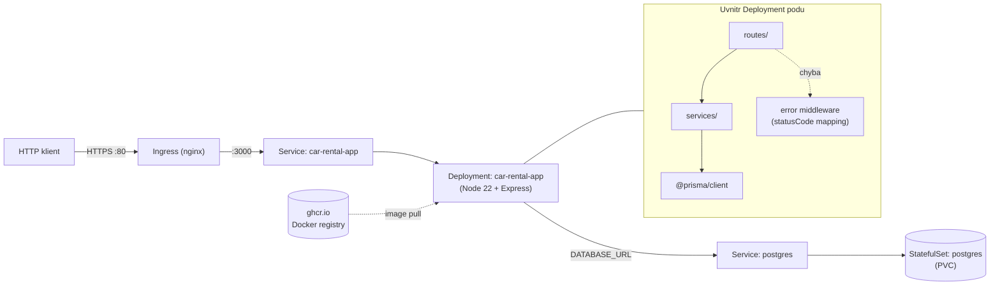

# Car Rental API

Semestralni prace z predmetu DevOps. Jednoduche REST API pro spravu aut v autopujcovne - zakladni CRUD operace, PostgreSQL databaze, kontejnerizace a deploy pres CI/CD do Kubernetes.

## Tech stack

- **Backend:** Node.js, Express
- **Databaze:** PostgreSQL, Prisma ORM
- **Kontejnerizace:** Docker, docker-compose
- **Orchestrace:** Kubernetes (Kustomize pro spravu konfiguraci)
- **CI/CD:** GitHub Actions
- **Registry:** ghcr.io

## API endpointy

| Metoda | URL | Co dela |
|--------|-----|---------|
| GET | /health | Health check |
| GET | /api/cars | Vypis vsech aut |
| GET | /api/cars/:id | Detail auta |
| POST | /api/cars | Pridani auta |
| PUT | /api/cars/:id | Uprava auta |
| GET | /api/customers | Vypis zakazniku |
| GET | /api/customers/:id | Detail zakaznika |
| POST | /api/customers | Vytvoreni zakaznika |
| PUT | /api/customers/:id | Uprava zakaznika |
| POST | /api/reservations | Vytvoreni rezervace |
| PATCH | /api/reservations/:id/confirm | Potvrzeni rezervace |
| PATCH | /api/reservations/:id/activate | Aktivace rezervace |
| PATCH | /api/reservations/:id/complete | Dokonceni rezervace |
| PATCH | /api/reservations/:id/cancel | Zruseni rezervace |
| PATCH | /api/reservations/:id/return | Vraceni auta |

### Error handling a HTTP kody

Error middleware (`src/app.js`) cte `err.statusCode` z doménových error trid (`src/utils/errors.js`):

| Trida | HTTP | Kdy |
|-------|------|-----|
| `ValidationError` | 400 | chybi povinne pole, format emailu, zaporna cena, ... |
| `NotFoundError` | 404 | nenalezena entita (car, customer, reservation) |
| `ConflictError` | 409 | duplicitni email, auto neni dostupne, kolize rezervace |
| `InvalidStateError` | 422 | neplatny prechod stavu rezervace |

Kazda odpoved chyby ma format `{ "error": "<message>" }`.

---

## Domena a pravidla

Autopujcovna se tremi entitami:

```
Customer 1──N Reservation N──1 Car
```

- **Car** — znacka, model, rok, cena/den, kategorie (standard/premium), status (available/maintenance/retired)
- **Customer** — jmeno, email, telefon, cislo ridicskeho prukazu + datum vydani
- **Reservation** — datum od/do, stav, celkova cena, datum vraceni

### Business pravidla

1. **Validace RP** — ridicky prukaz musi byt vydany min. pred 1 rokem, datum nesmi byt v budoucnosti
2. **Vypocet ceny** — `pricePerDay * dny`, premium auta 1.5x, sleva 10 % pri 7+ dnech
3. **Kolize** — nelze rezervovat auto ktere uz ma rezervaci na prekryvajici se datumy
4. **Stavove prechody** — pending → confirmed → active → completed, zadne preskoceni
5. **Dostupnost** — nelze rezervovat auto ve stavu maintenance/retired
6. **Zruseni** — zrusit jde jen pending nebo confirmed
7. **Pozdni vraceni** — vracet jde jen aktivni rezervaci, za kazdy den navic prirazka 1.5x denni sazby

### Stavy rezervace

```
pending → confirmed → active → completed
  ↓           ↓
cancelled   cancelled
```

## Architektura

Tri vrstvy, kazda dela jednu vec:

```
HTTP request → Routes (src/routes/) → Services (src/services/) → Prisma → PostgreSQL
```

- **Routes** — parsovani requestu, HTTP kody, error handling
- **Services** — business logika, validace pravidel, stavovy automat
- **Prisma** — pristup k DB

Dulezite soubory:

- `reservationService.js` — vytvoreni rezervace, kolize, vraceni auta
- `priceCalculator.js` — vypocet ceny s pravidly
- `stateMachine.js` — povolene stavove prechody
- `validators.js` — spolecne validace (email, datum, vek RP)
- `errors.js` — domenove error tridy s HTTP status kody

### Diagram komponent a datovych toku



Popis toku:
- Request prichazi pres Ingress na Service, ktery ho routne do Deploymentu
- V aplikaci: `routes → services → prisma → PostgreSQL`
- Chyby z services (`NotFoundError`, `ConflictError`, `ValidationError`, `InvalidStateError`) prochazi error middlewarem, ktery je mapuje na spravny HTTP kod
- Secrets (`db-secret`) a config (`db-config`) se mountuji do podu jako env promenne

---

## Testovaci strategie

Dva typy testu:

- **Unit testy** (`tests/unit/`) — testujou business logiku s mockovanou Prismou, bezi bez DB
- **Integracni testy** (`tests/integration/`) — testujou HTTP endpointy pres supertest, v CI bezi s realnym PostgreSQL

### Mocking

V unit testech mockujeme Prisma klienta (`jest.fn()`). Duvod — chceme testovat logiku, ne databazi. Diky tomu testy bezi rychle a nezavisi na stavu DB.

V integracnich testech se nemockuje nic — jde o overeni ze cely stack funguje dohromady.

### AAA pattern

Testy jsou psane jako Arrange-Act-Assert:

```javascript
it('should reject reservation for car in maintenance', async () => {
  // Arrange
  const car = createTestCar({ status: 'maintenance' });
  mockPrisma.car.findUnique.mockResolvedValue(car);

  // Act + Assert
  await expect(reservationService.create({ carId: 1, ... }))
    .rejects.toThrow('car is not available');
});
```

### Coverage

Mereni pres `jest --coverage`, threshold **70 %** (lines, branches, functions, statements) v `jest.config.js`. Report se uploaduje jako artefakt v CI (`coverage/`).

Aktualni cisla (unit + integration v CI):

| Vrstva | Lines | Branches | Poznamka |
|--------|-------|----------|----------|
| `src/services/` | ~98 % | ~95 % | pokryto unit testy s mockovanou Prismou |
| `src/utils/` | 100 % | 100 % | validators, errors |
| `src/routes/` | ~90 % | ~80 % | pokryto integracnimi testy se Supertestem |
| `src/app.js` | 100 % | 100 % | pokryto integracnimi testy |

Co se **vedome netestuje** (`collectCoverageFrom` exclude v `jest.config.js`):

- `src/server.js` — jen `app.listen()` + `process.env.PORT`, zadna logika
- `src/generated/**` — Prisma klient, generovany kod
- Nektere defensivni vetve v prisma-specificke logice (napr. `car.findUnique` null check uvnitr `returnCar` uz po validaci stavu) — nejsou dosazitelne pres verejne API

### TDD postup

Domenova logika vznikala v cyklu red-green-refactor. Typicky postup na priklade reservation state machine:

1. **RED** — napsat test na stavovy prechod (`test: add reservation states`), test failuje protoze service jeste nema logiku
2. **GREEN** — napsat minimalní implementaci (`feat: add reservation states`), testy prochazi
3. **REFACTOR** — vycistit kod, extrahovat state machine do vlastniho modulu (`refactor: extract states reservation`)

Stejny postup u customer service (nejdriv testy na validaci RP, pak implementace, pak extrakce validatoru do `utils/validators.js`) a u price calculatoru.

Ne vsechny commity jsou striktne 1:1 red/green — nekdy jsem spojil test + implementaci do jednoho commitu kdyz to bylo male. Ale refaktory jsou vzdy samostatne.

---

## CI/CD

### CI (`ci.yml`)

Spousti se na push a PR do main. Kroky:

1. `npm ci` + `prisma generate`
2. ESLint
3. Unit + integracni testy (Jest, Supertest, postgres bezi jako service v CI)
4. Coverage report + JUnit XML jako artefakty
5. Docker build a push do ghcr.io (jen na main branchi)

### CD (`cd.yml`)

- **Staging** — automaticky po uspesnem CI na main, deploy do k3d clusteru + smoke test
- **Production** — manualne pres workflow_dispatch, stejny postup

## Docker

Dockerfile pouziva multi-stage build (build stage pro prisma generate, production stage s node:22-alpine). Bezi pod non-root userem, ma HEALTHCHECK.

```bash
# spusteni pres docker-compose (app + postgres)
cp .env.example .env
docker-compose up
```

API pak bezi na `http://localhost:3000`.

## Kubernetes

Manifesty v `k8s/`, rozdelene pres Kustomize na base a overlaye:

- `base/` — Deployment, Service, StatefulSet (postgres), ConfigMap, Secret, Ingress
- `staging/` — overlay pro staging prostredi
- `production/` — overlay pro production prostredi

### Rozdily mezi prostredimi

| Konfigurace | Staging | Production |
|-------------|---------|------------|
| Namespace | `car-rental-staging` | `car-rental-production` |
| Replicas (app) | 1 | 2 |
| CPU request | 100m (base) | 200m (patch) |
| Memory request | 128Mi (base) | 256Mi (patch) |
| Memory limit | 256Mi (base) | 512Mi (patch) |
| `LOG_LEVEL` | `debug` | `info` |
| Ingress host | `staging.car-rental.local` | `car-rental.local` |
| Deploy trigger | automaticky po CI | manualne (`workflow_dispatch`) |
| Secrets zdroj | `k8s/staging/secrets.env` (gitignored) | `k8s/production/secrets.env` (gitignored) |

### Proc Kustomize

Vybral jsem Kustomize protoze je primo v kubectl (nic navic instalovat), pracuje se s cistym YAML bez sablon a vsechno je verzovane v gitu — takze to splnuje IaC pristup.

## Testy

```bash
npx jest                    # vse
npx jest tests/unit         # unit testy
npx jest tests/integration  # integracni (potrebuje postgres)
npx jest --coverage         # s coverage reportem
```

V jest configu je nastaveny coverage threshold na 70% — kdyz nekdo prida kod bez testu a pokryti klesne, CI neprojde. Super featura navic.

## Secrets

V repozitari nesmi byt zadne plaintext heslo. Reseni:

- `k8s/base/secret.yml` je jen sablona s `CHANGE_ME`, reserves nahrazuje overlay
- Overlays (`k8s/staging`, `k8s/production`) pouzivaji `secretGenerator` s odkazem na `secrets.env` soubor, ktery je v `.gitignore` — v repu je pouze `secrets.env.example` bez realnych hodnot
- V CD workflow se `secrets.env` generuje za behu z GitHub Secrets (`STAGING_DB_USER`, `STAGING_DB_PASSWORD`, `PRODUCTION_DB_USER`, `PRODUCTION_DB_PASSWORD`) tesne pred `kubectl apply`
- Pro lokalni vyvoj je `.env` soubor (take gitignored), sablona je `.env.example`
- Autentizace do `ghcr.io` v CI pres `GITHUB_TOKEN` z GitHub Secrets

### Lokalni priprava k8s secretu

```bash
cp k8s/staging/secrets.env.example k8s/staging/secrets.env
# v souboru nahradit REPLACE_ME skutecnym heslem
kubectl apply -k k8s/staging
```

## Spusteni lokalne

```bash
cp .env.example .env
npm install
npx prisma migrate deploy
npm start
```
